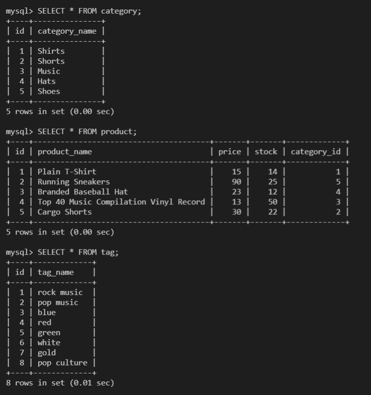
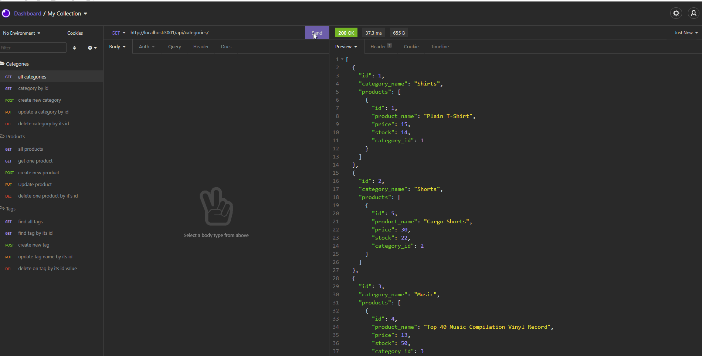

# E-Commerce Back End
Created by Shawn Miller

# Table of Contents
* [Description](#Description)
* [Installation Instructions](#Installation)
* [Technologies Used](#Technologies)
* [Appearance](Appearance)
* [Known Bugs](Known)
* [Contact info](Contact)

# Description
This app was created for a manager at an internet retail company that uses the latest technologies so that their company can compete with other e-commerce companies.

The following three tables are examples of the seeded tables used in the database.

# Installation Instructions
A user will need to download and install node.js, npm Sequelize, npm dotenv, npm mysql2 and npm express.  The user will need to log into mysql and SOURCE the provided schema.sql file to create the database.  The user will also need to update the .env file with their mysql password.  Once that is complete the user will just need run a 'npm start' at the command prompt.

# Technologies Used
- Node.js
- npm Sequelize
- npm dotenv
- npm mysql2
- npm express
- JavaScript

# Appearance

- The following link is a walkthrough video with audio that demonstrates the functionality of the E-Commerce Back End app working in node.js and tested using Insomnia Core.
https://watch.screencastify.com/v/olXTS1FdGReiyq7eXzST

# Known Bugs
No known bugs.

# Contact info
shawnsmm@gmail.com

github.com/Shawn52409

www.linkedin.com/in/shawn-miller-b44a36217